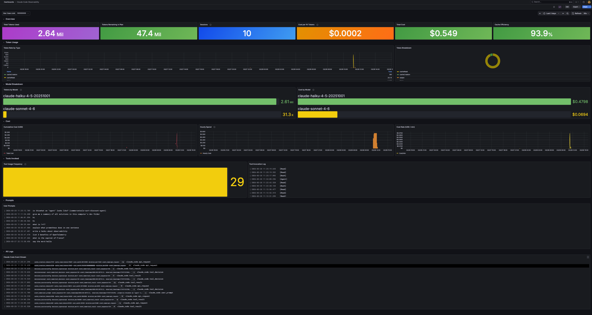
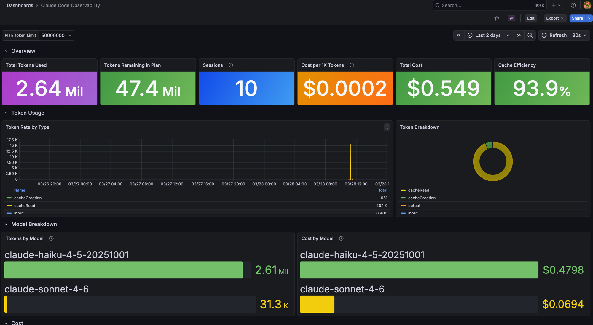
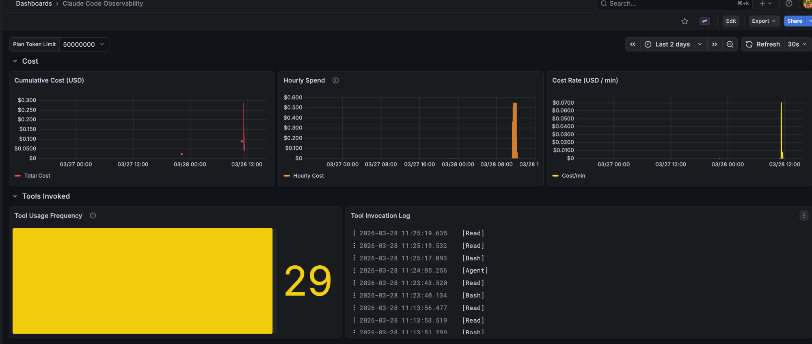
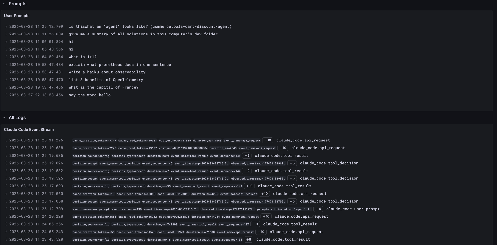

# Claude Code Local Observability

A self-hosted observability stack for [Claude Code](https://claude.ai/code) that captures telemetry data — token usage, costs, tool invocations, and user prompts — and surfaces it in a live Grafana dashboard.



---

## Use Case

Claude Code emits OpenTelemetry (OTel) telemetry data from every interactive session. This stack captures that data locally and turns it into actionable visibility:

- **Monitor token consumption** and track burn rate against your plan limit
- **Understand cost** — total, per model, per hour, and cost per 1K tokens
- **See which models you're using** and what each costs (useful when Claude Code switches between Sonnet and Haiku internally)
- **Audit tool activity** — which tools (Read, Bash, Agent, etc.) are being invoked and how often
- **Review your prompts** as a timestamped log
- **Optimize cache efficiency** — high cache read ratios mean less spend on repeated context

Everything runs locally in Docker. No data leaves your machine.

---

## Architecture

```
Claude Code (CLI)
      │
      │  OTLP HTTP (http/json) on :4318
      ▼
┌─────────────────────────┐
│    OTel Collector        │  otel/opentelemetry-collector-contrib
│                          │
│  Receivers:  otlp        │
│  Processors: memory_limiter, batch
│  Exporters:  prometheus  ──────────────► Prometheus :9090
│              otlp_http/loki ──────────► Loki :3100
└─────────────────────────┘
                                               │
                                               ▼
                                         Grafana :3000
                                   (auto-provisioned dashboard)
```

**Metrics** (counters, gauges) flow to Prometheus via the OTel Collector's Prometheus exporter endpoint (:8889). Prometheus scrapes it every 15 seconds.

**Logs** (events: api_request, tool_result, tool_decision, user_prompt) flow to Loki via its native OTLP endpoint. Loki retains 7 days of data.

**Grafana** is pre-provisioned with both datasources and the dashboard — no manual setup needed.

---

## Prerequisites

- [Docker Desktop](https://www.docker.com/products/docker-desktop/) (or Docker + Compose plugin)
- [Claude Code CLI](https://claude.ai/code) installed and authenticated
- The following environment variables set in your shell (`.zshrc` / `.bashrc`):

```bash
export CLAUDE_CODE_ENABLE_TELEMETRY=1
export OTEL_METRICS_EXPORTER=otlp
export OTEL_LOGS_EXPORTER=otlp
export OTEL_EXPORTER_OTLP_ENDPOINT=http://localhost:4318
export OTEL_EXPORTER_OTLP_PROTOCOL=http/json
export OTEL_METRIC_EXPORT_INTERVAL=5000
export OTEL_LOG_USER_PROMPTS=1
export OTEL_LOG_TOOL_DETAILS=1
```

> **Note:** Telemetry is only emitted from interactive Claude Code CLI sessions. The desktop app and `claude -p` (non-interactive) do not emit OTel data.

---

## Quick Start

```bash
git clone https://github.com/decisivepoet131/claude-local-observability
cd claude-local-observability
docker compose up -d
```

Open Grafana at **http://localhost:3000** — login with `admin` / `admin`.

Start a Claude Code session in a new terminal, then return to Grafana. Data appears within a few seconds.

---

## Auto-Start on Login (macOS)

The stack can be configured to start automatically when your Mac boots. Use the provided startup script:

```bash
# Register the LaunchAgent (run once)
cp scripts/startup.sh ~/Library/LaunchAgents/
# See scripts/startup.sh for the full launchctl plist setup
```

A companion LaunchAgent plist also sets the OTel environment variables system-wide via `launchctl setenv`, ensuring the variables are available to all processes (not just terminal sessions).

---

## Repository Structure

```
claude-local-observability/
├── docker-compose.yml                        # Orchestrates all 4 containers
├── otel-collector/
│   └── config.yaml                           # Receiver, processor, exporter config
├── prometheus/
│   └── prometheus.yml                        # Scrape config (OTel Collector :8889)
├── loki/
│   └── config.yaml                           # Storage, schema, 7-day retention
├── grafana/
│   └── provisioning/
│       ├── datasources/datasources.yaml      # Auto-provisions Prometheus + Loki
│       └── dashboards/
│           ├── dashboards.yaml               # Dashboard provider config
│           └── claude-code.json              # The Grafana dashboard
└── scripts/
    └── startup.sh                            # Docker startup script for LaunchAgent
```

---

## Dashboard Sections

### Overview
Six at-a-glance stats filtered by Grafana's time range picker:



| Stat | Description |
|---|---|
| Total Tokens Used | All token types (input, output, cache read, cache creation) |
| Tokens Remaining in Plan | `plan_limit - tokens_used` — color-coded red/yellow/green |
| Sessions | Count of user prompts sent in the time range |
| Cost per 1K Tokens | Effective rate — useful for comparing model efficiency |
| Total Cost | USD spend in the time range |
| Cache Efficiency | % of tokens served from cache — higher = cheaper |

The **Plan Token Limit** dropdown (top left) lets you select your plan tier (5M Pro / 50M Max / custom) to calibrate the "Remaining" stat.

### Token Usage
- **Token Rate by Type** — timeseries of token throughput split by `cacheRead`, `cacheCreation`, `input`, `output`
- **Token Breakdown** — donut chart showing the proportion of each token type

### Model Breakdown
- **Tokens by Model** — horizontal bar gauge showing token consumption per model
- **Cost by Model** — same, in USD

This section is particularly useful because Claude Code may use different models internally (e.g., Haiku for tool-heavy tasks, Sonnet for reasoning). The screenshot above shows Haiku accounting for the majority of token volume while Sonnet drives less usage — but the cost split tells a different story.

### Cost



- **Cumulative Cost** — running total; shows the trajectory of spend
- **Hourly Spend** — bar chart of cost per hour; highlights when heavy usage occurred
- **Cost Rate (USD/min)** — real-time spend rate

### Tools Invoked
- **Tool Usage Frequency** — bar gauge showing how many times each tool type was called
- **Tool Invocation Log** — timestamped log of every tool call, formatted as `[ToolName] result`

### Prompts & Logs



- **User Prompts** — clean, readable log of every prompt you sent, timestamped
- **Claude Code Event Stream** — raw event log with full structured metadata (useful for debugging or deep inspection)

---

## Data Retention

Both Prometheus and Loki are configured to retain **7 days** of data via named Docker volumes. Data survives container restarts. To wipe it:

```bash
docker compose down -v   # -v removes named volumes
```

---

## Ports

| Service | Port | Purpose |
|---|---|---|
| OTel Collector | 4317 | OTLP gRPC receiver |
| OTel Collector | 4318 | OTLP HTTP receiver (Claude Code sends here) |
| OTel Collector | 8889 | Prometheus metrics exporter |
| Prometheus | 9090 | Query UI + API |
| Loki | 3100 | Log ingestion + query API |
| Grafana | 3000 | Dashboard UI |
